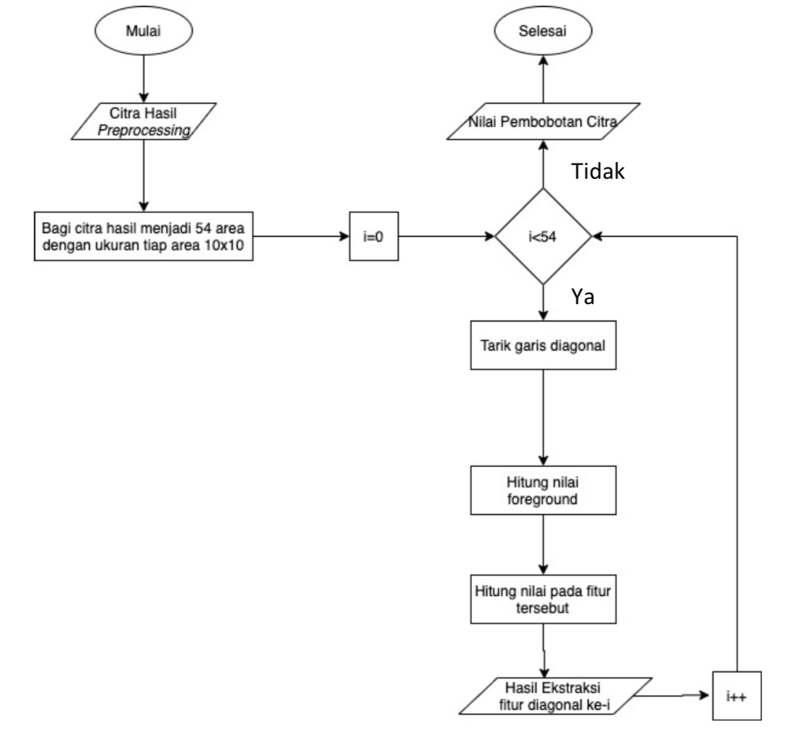
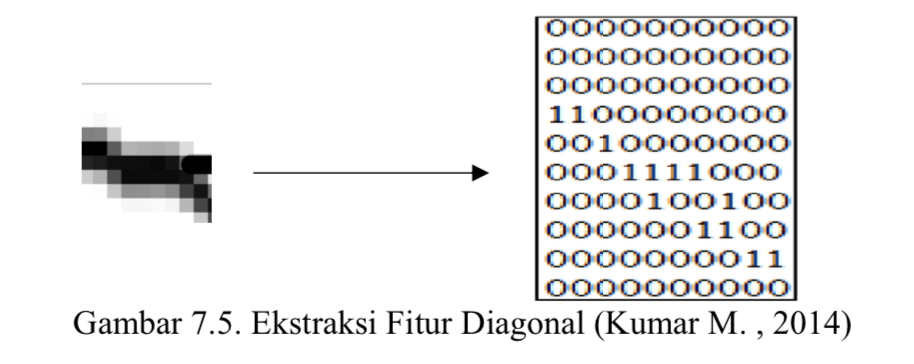
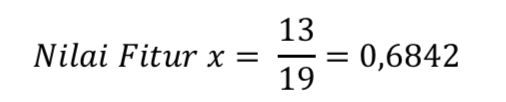

# balinese_character-Feature_Extraction

Fitur diagonal adalah metode ekstraksi fitur yang dapat digunakan untuk mendapatkan ciri-ciri karakter tulisan tangan. Ekstraksi fitur diagonal dilakukan dengan membagi sebuah citra menjadi beberapa zona sama besar. Pada satu zona akan ditarik garis diagonal pada setiap piksel di zona tersebut.

Hasil preprocessing dipecah menjadi ukuran 10x10 piksel sehingga, menjadikan citra memiliki 54 area atau fitur. Selanjutnya akan dicari nilai pada setiap fiturnya. Pada setiap fitur ini akan ditarik garis diagonal sesuai dengan ukuran fitur, dimana dengan ukuran setiap fitur 10x10 piksel maka akan menghasilkan sebanya 19 buah garis diagonal dimana 19 garis ini adalah sub-fitur. Selanjutnya akan dihitung total nilai dari seluruh piksel foreground yang ada pada fitur tersebut. Nilai-nilai ini akan dirata-ratakan untuk membentuk nilai tunggal pada fitur yang ditempatinya. Proses ini akan berulang hingga seluruh fitur didapatkan nilainya. Seluruh nilai dari fitur ini akan menjadi bobot nilai yang akan digunakan pada proses klasifikasi.

Dimisalkan, pada salah satu fitur 𝑥 dengan ukuran akan dicari nilai yang ada berdasarkan warna biner yang dimiliki. Angka 1 menunjukan bagian foreground citra yang memiliki warna hitam.

Pencarian nilai fitur ini dilakukan dengan bergerak secara diagonal. Dimana pergerakan ini menghasilkan 19 garis diagonal atau sama dengan 19 sub-fitur. Nilai-nilai dari sub-fitur ini akan dirata-ratakan sehingga membentuk nilai pada fitur 𝑥 tersebut. Sebagai contoh, pada gambar 7.6 memiliki nilai fitur 0,6842. Ini didapatkan dari seluruh nilai foreground yang ada pada gambar yang bernilai 13, selanjutnya akan dicari rata-rata fitur tersebut sehingga.

Setelah nilai fitur 𝑥 ini ditemukan, maka akan dilanjutkan ke fitur selanjutnya hingga seluruh nilai fitur didapatkan.
